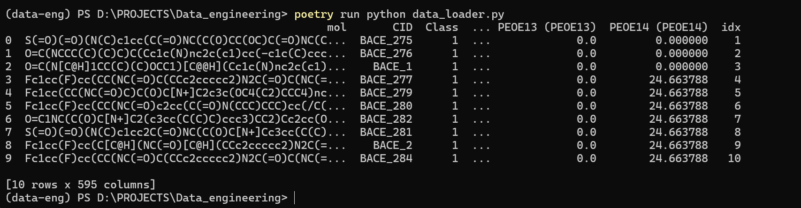

# data-engineering

## Описание датасета
В проекте используется датасет `rev8020split_desc.csv` из библиотеки **DeepChem**.  
Ссылка: https://github.com/deepchem/deepchem/blob/master/datasets/rev8020split_desc.csv 
Ссылка на гугл диск: https://drive.google.com/file/d/1lbOez3uheggR4F7jqCHgVNfVtvucCSp4/view?usp=sharing

Краткая характеристика датасета:
1) RangeIndex: 1475 entries, 0 to 1474
2) Columns: 595 entries, mol to idx
3) dtypes: float64(210), int64(382), object(3)
4) memory usage: 6.7+ MB

- Каждая строка соответствует отдельной молекуле  
- Столбцы содержат молекулярные дескрипторы (числовые признаки), а также идентификаторы (`mol`, `smiles`, `idx`)  
 
Данные подходят для:
- обработки и анализа химических данных,  
- построения ETL-процессов,  
- задач машинного обучения (регрессия/классификация).  

## Настройка проекта

1. **Клонирования репозитория:**
```powershell
git clone https://github.com/KurbanovDavid777/data-engineering.git
cd D:\PROJECTS\Data_engineering
```

2. **Активировать conda окружение:**
```powershell
conda create -n data-eng python=3.13 -y
conda activate data-eng
```

2. **Установить зависимости через Poetry:**
```powershell 
poetry install
poetry config virtualenvs.in-project true
```

3. **Установка необходимых библиотек через Poetry:**
```powershell 
poetry add pandas matplotlib jupyterlab wget
```

4. **Установить переменную окружения FILE_ID (только первый раз):**
```powershell 
conda env config vars set FILE_ID=1lbOez3uheggR4F7jqCHgVNfVtvucCSp4
conda activate data-eng
```

## Запуск скрипта проекта

1. **Запустить скрипт для чтения датасета:**
```powershell
poetry run python data_loader.py
```

---

## Первые 10 строк даты


