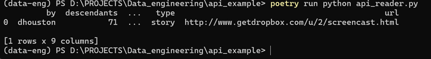

# HackerNews API Example

## Ссылка на API
[HackerNews API](https://github.com/HackerNews/API)

## Скрипт
`api_reader.py` загружает данные о топ-посте с HackerNews API и сохраняет их в **Pandas DataFrame**.  
Скрипт извлекает ключевые поля поста:
- `by` — автор поста
- `descendants` — количество комментариев
- `id` — уникальный идентификатор поста
- `title` — заголовок поста
- `type` — тип записи (`story`, `comment` и т.д.)
- `url` — ссылка на источник/ресурс поста

## Результат
Скриншот вывода скрипта:



Пример DataFrame, который создается скриптом:

| by       | descendants | id   | title                                   | type  | url                                         |
|----------|-------------|------|-----------------------------------------|-------|---------------------------------------------|
| dhouston | 71          | 8863 | My YC app: Dropbox - Throw away USB drive | story | http://www.getdropbox.com/u/2/screencast.html |

## Сохранение данных
CSV-файл с данными не хранится в репозитории (папка `data/` добавлена в `.gitignore`).  
Скрипт сохраняет данные локально:

```python
df.to_csv("../data/hackernews_post.csv", index=False)
